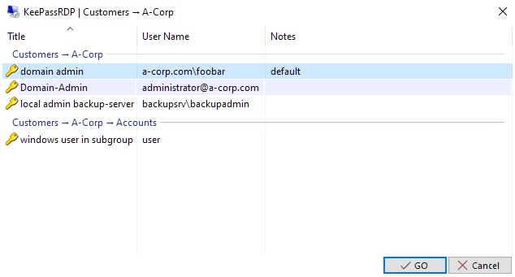
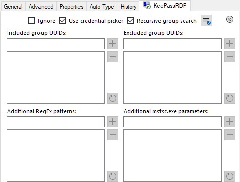
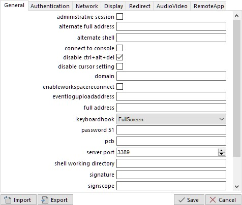
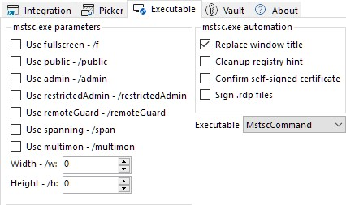
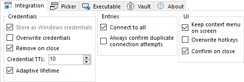

[zip]: https://github.com/iSnackyCracky/KeePassRDP/releases/latest/download/KeePassRDP_v2.2.zip
[exe]: https://github.com/iSnackyCracky/KeePassRDP/releases/latest/download/KeePassRDP_v2.2.exe

# KeePassRDP
[](https://github.com/iSnackyCracky/KeePassRDP/releases/latest)
[][zip]
[][exe]
[](https://github.com/iSnackyCracky/KeePassRDP/releases/latest)
[](https://github.com/iSnackyCracky/KeePassRDP/releases)
[](COPYING)

## Overview
KeePassRDP is a plugin for KeePass 2.x which adds various options to connect to the URL of an entry via RDP.

## Installation
1. <sub>[][zip]</sub> or <sub>[][exe]</sub> of the latest <sub>[](https://github.com/iSnackyCracky/KeePassRDP/releases/latest)</sub>.
2. Run the [self-extracting exe](#silent-extraction), or unzip and copy the KeePassRDP.plgx file to your KeePass plugins folder *`(e.g. %ProgramFiles%\KeePass Password Safe 2\Plugins)`*.
3. Start KeePass and enjoy using KeePassRDP.

## Usage
To connect to target computers via RDP select one or more entries containing the IP-address(es) or hostname(s), right-click and select `KeePassRDP > Open RDP connection` (or simply press <kbd>CTRL</kbd> + <kbd>M</kbd>). A [selection dialog](#selection-dialog) will be shown when multiple credentials are found.

>

To use one of the other connection options select the corresponding item from the context menu, or press the [configurable keyboard shortcut](#keyboard-shortcuts).

## Features
- Connect to host via RDP
- Connect to host via RDP admin session (`mstsc.exe /admin` parameter)
- Support for `mstsc.exe` parameters (`/f`, `/span`, `/multimon`, `/w`, `/h`, `/public`, `/restrictedAdmin`, `/remoteGuard`)
- Select from matching (Windows or domain) credentials when the target entry is inside a configurable trigger group ([see below](#trigger-group--folder))
- Automatic adding and removing of credentials to and from the Windows credential manager ([how it works](#how-it-works))
- Configurable [keyboard shortcuts](#keyboard-shortcuts)
- Configurable [context menu](#context-menu--toolbar-items)
- Configurable [toolbar items](#context-menu--toolbar-items)
- Configurable [credential lifetime](#credential-lifetime)
- General [automatization helpers](#automatization-helpers)
- Customizable [credential picker](#credential-picker)
- Customizable [per entry settings](#individual-entry-settings)
- Support for [advanced settings](#advanced-settings) through .rdp files
- Support for [self-signing](#automatization-helpers) of .rdp files
- Support for DPI-scaling
- Made with :heart: and :pizza:

## Languages
<sub>[](#languages)</sub> English
| <sub>[](#languages)</sub> German

See how to [translate](#translate).

<br>

## Documentation

### Trigger group / folder
How we use the KeePassRDP on a daily basis (I work for an MSP where we use KeePass to securely store credentials for accessing customer domains and computers):

Given a KeePass database that could be structured like this:

>

Where each group contains entries specific to the customer.

If there is only a single jumphost or something similiar, we usually place an entry like the following directly into the customer group:

>

When a customer has many hosts and/or requires multiple accounts, we create a subgroup called **RDP** inside the customer group:

>

>><small>The name of the trigger group can be configured from within the [KeePassRDP options form](#credential-picker) *(since v2.0)*.</small>

It might contain entries like these:

>

Credentials are looked up from the customer/parent group in that case (by default they can also be in different subgroups within the customer group):

>

>><small>Ignoring entries can be toggled via the [KeePassRDP context menu](#usage) *(since v1.9.0)* or from the toolbar *(since v2.0)*.</small>

<div id="selection-dialog"></div>

To connect to one of the targets in the **RDP** group (using credentials) select the entry, press <kbd>CTRL</kbd> + <kbd>M</kbd> and KeePassRDP will show a dialog with filtered account entries (matching the titles by a [configurable regular expression](#credential-picker-regex), *e.g. domain-admin, local user, ...*).

>

Finally you just have to choose the credential you want to use and click "GO" (or press <kbd>Enter</kbd>).

<br>

<div id="individual-entry-settings"></div>

><small>Individual entry settings can be set from the KeePassRDP tab on the edit entry form *(since v2.0)*.</small>
>
>>

<div id="advanced-settings"></div>

><small>Advanced settings can be configured through .rdp files *(since v2.1)*.</small>
>
>>

### Keyboard shortcuts

>Fully configurable from within the KeePassRDP options form.
>
>>

### Context menu / toolbar items

>Visibility of items is configurable from within the KeePassRDP options form.
>
>>

### Credential picker

>Customizable from within the KeePassRDP options form.
>
>>
>
><div id="credential-picker-regex"></div>
>
>>

### Automatization helpers

>Can be activated from within the KeePassRDP options form.
>
>>


## How it works
The plugin basically calls the default `mstsc.exe` with the `/v:<address>` (and optionally other) parameter(s) to connect.

Opening a connection ***with credentials*** will save the selected credential(s) into the Windows credential manager ("vault") for access by the `mstsc.exe` process.

The credential(s) will then be removed depending on how [KeePassRDP is configured](#credential-lifetime).

When using .rdp files a temporary file is created and removed after the `mstsc.exe` process exits.

### Credential lifetime

>Configurable from within the KeePassRDP options form.
>
>>

## Translate

You can use [Resources.de.resx](KeePassRDPResources/Resources.de.resx) as a starting point.

1. Copy and rename the file according to the language you are translating into *(e.g. KeePassRDP.**es-ES**.resx for spanish)*.
2. Translate as much as wanted.
3. Create a binary resource file from the ResX template by entering the following into a VS Developer Command Prompt:
```bat
resgen.exe KeePassRDP.es-ES.resx
```
4. Copy the generated `KeePassRDP.es-ES.resources` file to `%AppData%\KeePass`.
5. Please share your progress with the KeePassRDP community :heart:.

<small>:bulb: *This also allows overwriting of all (translatable) built-in strings.*</small>


## Silent extraction
The following example will extract the .plgx file and overwrite it in the target folder:

```bat
KeePassRDP_v2.1.exe /Q:A /C /T:"%ProgramFiles%\KeePass Password Safe 2\Plugins"
```

<small>:bulb: *Writing into %ProgramFiles% usually requires administrator privileges.*</small>

## Building instructions
Just clone the repository:

```bash
git clone https://github.com/iSnackyCracky/KeePassRDP.git
```

Open the solution file (KeePassRDP.sln) with Visual Studio and build the KeePassRDP project:

>

You should get a ready-to-use .plgx, .zip and .exe file like the ones from the releases.

<small>:bulb: *Remember to place a copy of KeePass.exe in the KeePass folder.*</small>

## Third-party software
KeePassRDP makes use of the following third-party libraries:
- the *awesome* [**Json.NET**](https://github.com/JamesNK/Newtonsoft.Json) by James Newton-King
- the *awesome* [**PLGX Build Tasks**](https://github.com/walterpg/plgx-build-tasks) by Walter Goodwin
- [**Visual Studio 2022 Image Library**](https://www.microsoft.com/en-us/download/details.aspx?id=35825) by Microsoft